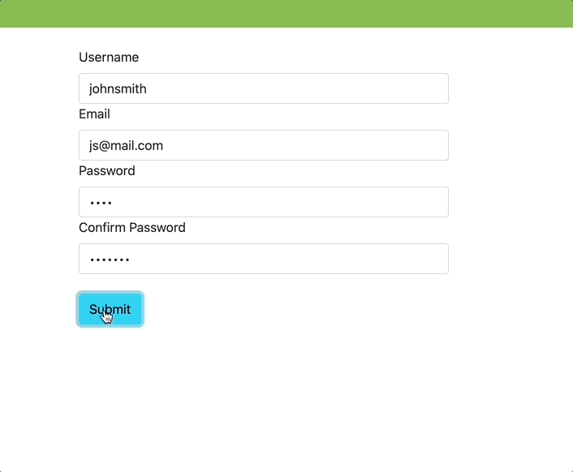

# myCart

## Overview

Full-stack website built solo over the course of 10 days using a React front end and Django back end. 

[myCart](https://mycart-dev.herokuapp.com/)


---

## Brief
---
1. Build a full stack application with a React front end and Django back end.
2. Build a fully functional RESTful API with all CRUD routes (GET, POST, PUT, DELETE).
3. Use at least one OneToMany & one ManyToMany relationships.
4. Custom Authentication.

## Technologies Used
---
### Back end
* Python
* Poetry
* Django
* Django REST framework
* PyJWT
* Stripe
* python-decouple
### Front end
* React
* React router dom
* React Bootstrap
* Axios
* FontAwesome
* Stripe
### Other
* Figma (design)
* Postbird
* Asana (tracking)

## Approach
---

### Planning

I decided I wanted to build a fully-responsive e-commerce site with a working payment function. I also decided to use a new CSS framework (Bootstrap React) as well. 

Overall I was also looking to make something with a more minimal, less cluttered visual design than I had in the past. I used Figma to make a simple mockup and Asana to track my projected to-do’s


From there I built a small, separate, one-component React App to get comfortable with Stripe and integrating it (and to gauge if implementing it into this project would take too long to complete).

### Back end
---
For this app I knew I would need models for the user, products, shopping cart, and reviews as a stretch. My models for the user, products (and eventually, reviews) were relatively straightforward, but the cart was by far the most challenging. The model itself was simple, but its views were where I spent most of my time on the back end.

```python
class Cart(models.Model):
    user = models.ForeignKey(User, on_delete = models.CASCADE)
    order_items = models.ManyToManyField("products.Product",related_name="cartItem",blank=True)

    def __str__(self):
        return f'{self.user.username}\'s Cart'

    def get_total(self):
        total = 0
        for each_item in self.order_items.all():
            total += each_item.price
        return '{:.2f}'.format(total)

    def clear_cart(self):
        self.order_items.clear()
        return self
```

Specifically, adding or removing items via put request, and I ended up needing to add an operation field in my request to handle that behavior, as well as needing a fair amount of transforming the request and the current data. Below is the code for removing one item from the cart and returning the new cart to the front end:
```python
        if request.data.get('operation') == 'remove':
            try:
                current_cart = list(cart.order_items.all())
                items_to_remove = request.data.get('order_items')
                transformed_items = list(map(lambda item: Product.objects.get(id=item),items_to_remove))
                new_cart=[x for x in current_cart if x not in transformed_items]
                cart.order_items.set(new_cart)
                serialized = PopulatedCartSerializer(cart)
                cart_with_total = {**serialized.data,'total':cart.get_total()}
                return Response(cart_with_total, status = status.HTTP_200_OK)
            except Exception as e:
                print(e)
                return Response({'message': 'items not removed'},status=status.HTTP_409_CONFLICT)
 
```

### Front end

### Registration
Using immediately invoked function expressions in the JSX for the registration form allowed for granular error handling:
```jsx
<Form.Group controlId='username'>
              <Form.Label>Username</Form.Label>
              <Form.Control type='text' onChange={handleChange} />
              {(()=> (submissionErrors() && (error.username)))() && <Alert variant='warning'>{error.username}</Alert>}
            </Form.Group>
            <Form.Group controlId='email'>
              <Form.Label>Email</Form.Label>
              <Form.Control type='email' onChange={handleChange} />
              {(()=> (submissionErrors() && (error.email)))() && <Alert variant='warning'>{error.email}</Alert>}
            </Form.Group>
            <Form.Group controlId='password'>
              <Form.Label>Password</Form.Label>
              <Form.Control type='password' onChange={handleChange} />
              {(()=> (submissionErrors() && (error.password)))() && <Alert variant='warning'>{error.password}</Alert>}
            </Form.Group>
            <Form.Group controlId='password_confirmation'>
              <Form.Label>Confirm Password</Form.Label>
              <Form.Control type='password' onChange={handleChange} />
              {(()=> (submissionErrors() && (error.password_confirmation)))() && <Alert variant='warning'>{error.password_confirmation}</Alert>}
            </Form.Group>
            <br />
            <Button variant="info" type="submit">
              Submit
            </Button>
            {displayMessage ? (
              <Alert variant='success'> Registration Successful! You will be redirected shortly</Alert>
            ) : submissionErrors() && (<Alert variant='warning'>Please check that all fields are correct</Alert>)
            }
          </Form>
```





### Cart


Even prior to adding the stripe integration, managing states in React was a challenge on this page, and my solution was to again use immediately invoked functions within the JSX to allow for checking on the latest state and conditionally rendering based off the returned value :
```jsx
<Accordion>
                  {(() => Object.keys(cart).length !== 0)() && cart.items.map((item, index) => {
                    return (
                      <Accordion.Item eventKey={index + 1} key={index}>
                        <Accordion.Header>
                          <Col>
                            {item.name}
                          </Col>
                          <Col>
                            <span className='pull-right'><Image src={item.small_image} rounded /></span>
                          </Col>
                        </Accordion.Header>
                        <Accordion.Body>
                          <Row>
                            <Col md={3}>
                              <Alert variant='primary'>{`$${item.price}`}</Alert>
                            </Col>
                            <Col md={{ span: 3, offset: 3 }}>
                              <Button
                                variant='danger'
                                size='sm'
                                onClick={() => removeFromCart(item.id)}
                              >
                                Remove from Cart
                              </Button>
                            </Col>
                          </Row>
                        </Accordion.Body>
                      </Accordion.Item>
                    )
                  })}
                </Accordion>
```

### Reviews


After implementation of the cart, I wanted to flesh out each product with reviews, and having them display instantly. As the back end already was set for accepting a number from 1-5 I was able to use a progress bar and form components to allow for a visually appealing review submission, as well as trigger a re-render of the existing reviews (with an associated query to the back end for the just-submitted review). 

Displaying the reviews required some error handling/validation to account for products with no reviews as well as the initial loading prior to a successful api get request
```jsx
{
            (() => {
              if (isEmpty(item) || errors) return false
              else return true
            })() ?
              <ListGroup>
                {item.review_set.length ?
                  (item.review_set.map((review, index) => (
                    <ListGroup.Item key={index}>
                      <ProgressBar
                        min={1}
                        max={5}
                        animated
                        variant='success'
                        now={review.rating}
                        label={review.rating}
                      />
                      {review.text}
                    </ListGroup.Item>
                  )))
                  :

                  <><br /><ListGroup.Item>
                    <ProgressBar
                      min={1}
                      max={5}
                      animated
                      now={3}
                      variant='secondary' />
                    Be the first to leave a review!
                  </ListGroup.Item></>

                }
              </ListGroup>
              :
              <Placeholder animation='glow' as={Card}>
                <Placeholder xs={12} />
                <Placeholder xs={12} />
                <Placeholder xs={12} />
                <Placeholder xs={12} />
                <Placeholder xs={12} />
              </Placeholder>
          }
```

### Payment


Other than a responsive design, the main goal I had was a working payment acceptance. I decided to go with stripe based on their extremely thorough documentation, which required a small backend addition to create a payment intent with Stripe as well as to calculate the amount owed based on the products in the cart
```python
from rest_framework import status
from rest_framework.decorators import api_view
from rest_framework.response import Response
import stripe
from decouple import config
from cart.models import Cart  

stripe.api_key = config('STRIPE_SECRET_KEY')

@api_view(['POST'])
def create_payment(request):
    cart = Cart.objects.get(user=request.user)
    total = int(float(cart.get_total()) * 100)
    try:
        intent = stripe.PaymentIntent.create(
            amount = total,
            currency = 'usd',
            automatic_payment_methods = {
                'enabled': True,
            },
        )
        # print(intent)
        return Response({ 'clientsecret': intent['client_secret']})
    except Exception as e:
        return Response(str(e),status=status.HTTP_403_FORBIDDEN)
```

On the front end, the React Stripe package allowed for a relatively straightforward implementation as their elements are pre-built, so all I needed to do was correctly handle a few variables:

```javascript
const apiKey = process.env.REACT_APP_STRIPE_PUBLISHABLE_KEY
  const stripePromise = loadStripe(apiKey)
  const [clientSecret, setClientSecret] = useState('')

  const appearance = {
    theme: 'flat',
    variables: {
      colorPrimary: '#009257',
      colorBackground: '#cbeade'
    }
  }
  const options = {
    clientSecret,
    appearance
  }
```

And pass them to the provided elements:
```jsx
<Container id='money'>
          <div className="App" id="stripe-checkout">
            {clientSecret && (
              <Elements options={options} stripe={stripePromise}>
                <CheckoutForm />
              </Elements>
            )}
          </div>
        </Container>

```

And finally changing the redirection url to one that will clear the current user’s cart with a useEffect and subsequently redirect back to the homepage:

```jsx
const { error } = await stripe.confirmPayment({
      elements,
      confirmParams: {
        return_url: 'https://mycart-dev.herokuapp.com/clear/'
      }
    })

```

## Wins
---
* Payment integration - while I was only using test data, I was pleased that everything worked as expected
* Conditional renders and help messages - I spent a fair amount of effort coding in error handling to avoid broken components due to API issues, as well as using modals and toast messages to provide user feedback
* Overall functionality - I had set a lot of goals for myself, and while I did not reach them, I was pleased at how much functionality I was able to include in the site, despite running out of time to polish the design I had in mind.
	
## Challenges
---
* Responsive design - I wanted to try using a new CSS framework, but adapting from what I was used to from my last large project to this one was a much larger challenge than I had expected. Additionally, due to the stripe integration some of the styling elements I had put in were broken
* Payment integration - this was more of a time sink than a conceptual challenge, as I built a completely separate app to test how difficult it would be to integrate payments. Additionally as mentioned, including it caused some difficulties with styled elements that I had already included.
* Time management & organization - I struggled to move on when stumped in many cases, which led to a lot of wasted time when compared to how well utilized my time was in previous projects. 
* Deployment - my initial project structure (and choice of poetry to manage my virtual environment) made deployment to Heroku a bit challenging as I had to re-organize the whole project, and in doing so caused myself some build issues.

## Key Takeaways
---

* Time management & planning - Since I was working on my own for this project, I was less fastidious in updating tracking tools like Asana or a pomodoro timer than in other projects, and as a result there were todo’s that were not prioritized at the right time, or at all. Additionally, as referenced in the challenges above, there was a fair amount of time that could have been utilized better had I moved on from blockers in a more efficient manner.
* Django & Python - This project was my first using Django/Python, and in particular getting used to class-based views was quite an adjustment as everything I had worked on prior had been functional.  However, the finished result on the back end was something I ended up being very pleased with. 

## Future Features
---
* Design - In particular, I wanted to implement 2 ways to browse, the 'gallery' approach that made it into the project, and a card-based view that would allow for viewing and searching multiple products at the same time.
* Account management - allow for changing passwords/account deletion.
* Styling - There are some issues with the stripe iframe rendering underneath the footer, so given additional time I would go back to fix these and some responsiveness features.